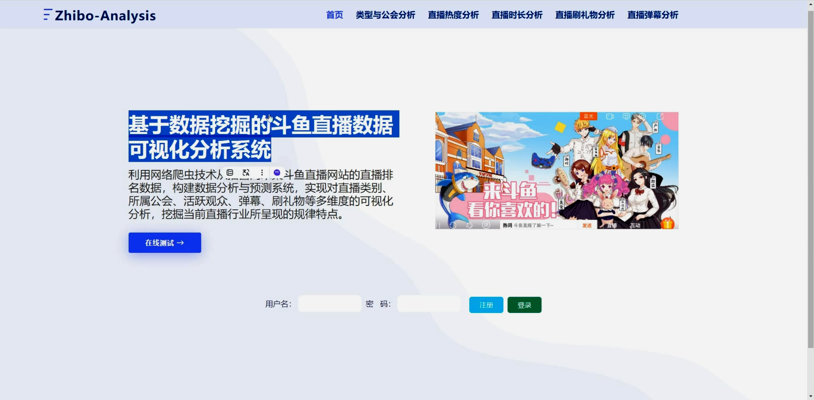
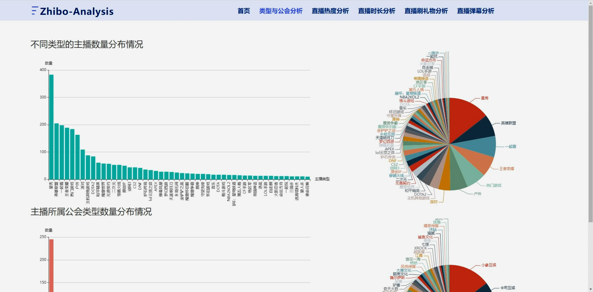
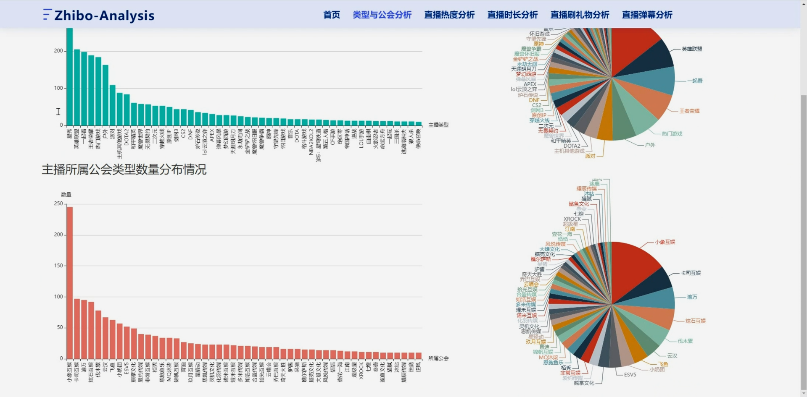
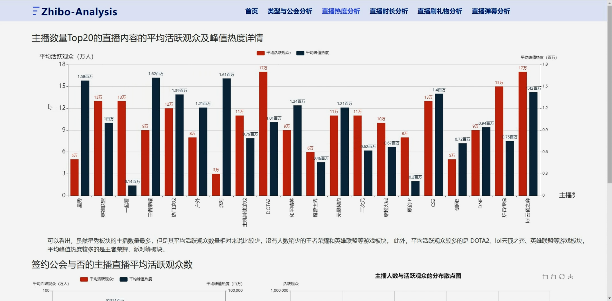
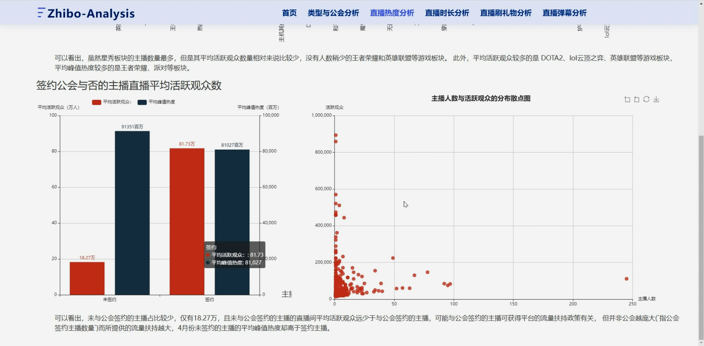
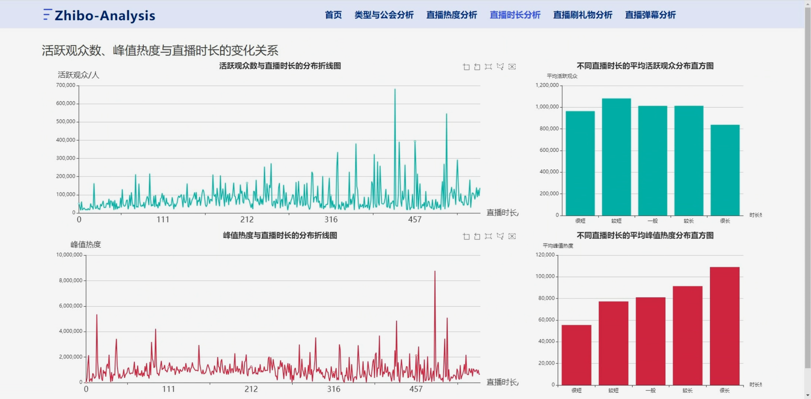
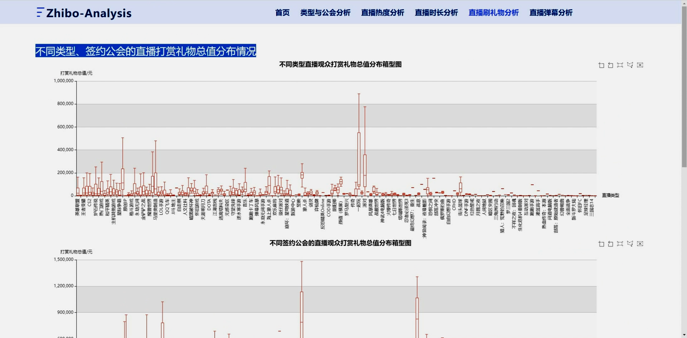
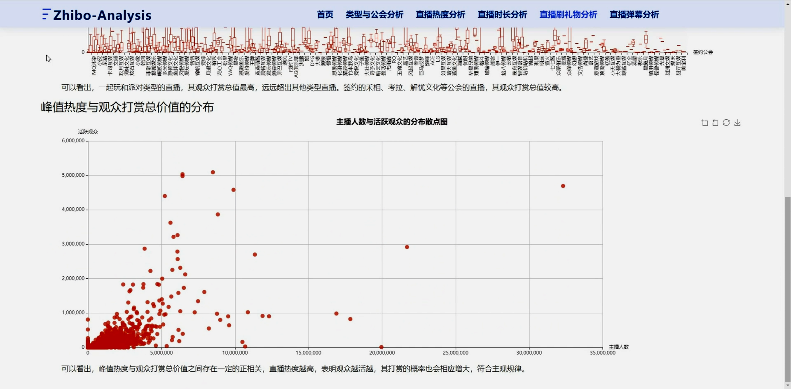
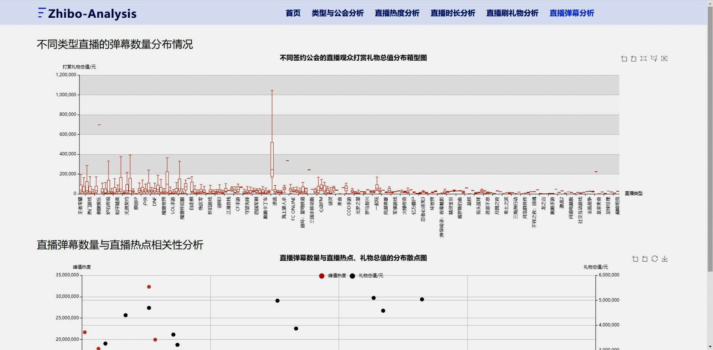
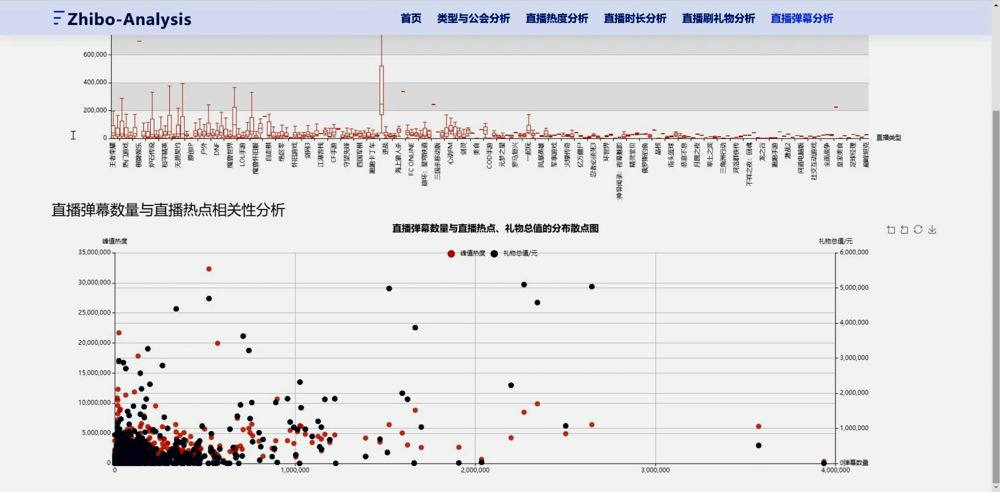

## 计算机毕业设计Python+大模型斗鱼直播可视化 直播预测 直播爬虫 直播数据分析 直播大数据 大数据毕业设计 机器学习 深度学习

## 要求
### 源码有偿！一套(论文 PPT 源码+sql脚本+教程)

### 
### 加好友前帮忙start一下，并备注github有偿纯python斗鱼分析
### 我的QQ号是2827724252或者798059319或者 1679232425或者微信:bysj2023nb 

# 

### 加qq好友说明（被部分 网友整得心力交瘁）：
    1.加好友务必按照格式备注
    2.避免浪费各自的时间！
    3.当“客服”不容易，repo 主是体面人，不爆粗，性格好，文明人。
## 介绍
随着网络直播平台的兴起，斗鱼直播作为其中的佼佼者，吸引了大量用户和观众。
为了更好地理解和分析斗鱼直播中的数据，本项目介绍了一个基于数据挖掘的斗鱼直播数据可视化分析系统。
该系统利用Python编程语言，结合网络爬虫技术，从斗鱼直播平台抓取相关数据，
并使用Pandas进行高效的数据分析处理。
最终，通过Flask框架搭建Web应用，并结合ECharts实现数据的可视化展示。
## 功能：
1-数据采集：首先，利用Python编写网络爬虫程序，对斗鱼直播平台进行数据抓取。爬虫程序能够自动访问直播间页面，提取关键信息如直播标题、观看人数、弹幕内容等。
2-数据分析：收集到的原始数据经过清洗后，使用Pandas库进行进一步的分析处理。通过对数据的统计、聚合和筛选，得到关于直播内容、主播人气和观众互动等方面的洞察。
3-系统架构：采用Flask框架构建Web应用，将分析结果以API的形式提供给前端页面。Flask的轻量级特性使得系统的开发和部署更加灵活高效。
4-数据可视化：借助ECharts图表库，在前端页面上实现数据的可视化展示。通过柱状图、折线图、饼图等多种图表形式，直观地呈现分析结果，帮助用户快速把握数据背后的规律和趋势。

## 演示视频
https://www.bilibili.com/video/BV1X4421Q7Qz/?spm_id_from=333.999.0.0
##  运行截图

